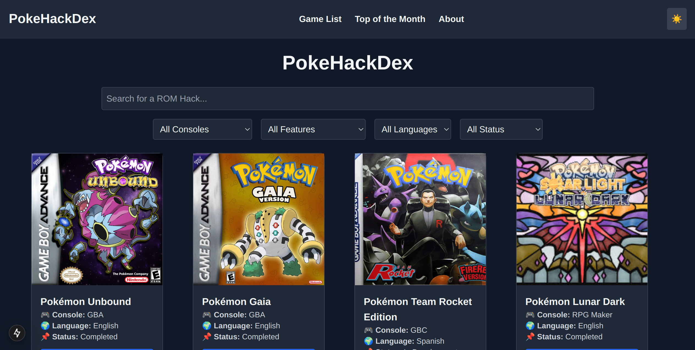

# 🎮 PokeHackDex - Pokémon ROM Hack Catalog  

  

🚀 **PokeHackDex** is a community-driven catalog of Pokémon ROM hacks, allowing players to discover and explore fan-made Pokémon games easily.  

---  

## 🌟 Features  

- 🔍 **Search & Filter**: Find ROM hacks by name, console, language, features, and more.  
- 🎮 **Supported Consoles**: GBA, GBC, NDS, RPG Maker.  
- 🌙 **Dark Mode**: Toggle between light and dark mode for a better experience.  
- 📜 **Game Details**: View full game descriptions, features, and download links.  
- 🔗 **Social Links**: Easily access Discord, Twitter, and websites for each ROM hack.   

---  

## 🛠 Installation & Setup  

1️⃣ Clone the repository:  
```sh  
git clone https://github.com/tu-usuario/pokehackdex.git  
cd pokehackdex  
```  

2️⃣ Install dependencies:  
```sh  
npm install  
```  

3️⃣ Run the development server:  
```sh  
npm run dev  
```  

🔗 Open [http://localhost:3000](http://localhost:3000) in your browser.  

---  

## 📦 Deployment  

The project can be deployed on **Vercel**:  

1️⃣ Install Vercel CLI (if not installed):  
```sh  
npm install -g vercel  
```  

2️⃣ Deploy:  
```sh  
vercel  
```  

3️⃣ Follow the on-screen steps and your project will be live!  

---  

## 🎨 Technologies Used  

- **Next.js** - Server-side rendering and static site generation.  
- **Tailwind CSS** - Modern styling with dark mode support.  
- **React Icons** - For social media icons.  
- **Vercel** - Easy deployment.  

---  

## 📌 Contributing  

Want to contribute? Feel free to fork the repo, submit pull requests, or suggest features!  

---  

## 📄 License  

This project is **open-source** under the [MIT License](LICENSE).  

---  

## 📬 Contact  

- Youtube: [@LinuxDroidMaster](https://www.youtube.com/@LinuxDroidMaster)  
- Reddit: [@LinuxDroidMaster](https://www.reddit.com/user/linuxdroidmaster/)
